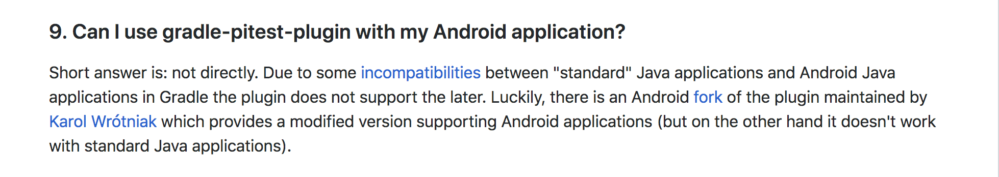

## Fixing broken robots - Android Mutation Testing
### DroidConSG 2019

---

<p><span class="slide-title">About me</span></p>


- Matthew Vern / Panini
- Twitter [@panini_ja]()
- Github panpanini
- Mercari, Inc
- Software Engineer (Android)

---
# My job
<!-- <p><span class="slide-title">My job</span></p> -->

- Client Engineer
- Solving problems for our customers
- Shipping features
- Improve existing functionality

Note:
Emphasis on quality

---

<p><span class="slide-title">My job</span></p>

- A non-shipped feature doesn't provide benefit
- Ship features as quick as possible


---

<p><span class="slide-title">My job</span></p>

- A shipped, broken feature doesn't provide benefit
- Ship _quality_ features as quick as possible

---

<p><span class="slide-title">Maintaining quality</span></p>

- QA |
- Code Review |
- Tests |

---

<p><span class="slide-title">Maintaining quality</span></p>

- How do we know our tests are providing quality
    - Use coverage to make sure that our tests are calling production code
    - higher coverage, more insurance that changes introduced will not break existing code
    - higher coverage, more insurance that new code _does what it says on the tin_

---

 Who -watches- tests the ~watch~ testmen?

---

<p><span class="slide-title">Maintaining quality</span></p>

- How do we know that our tests are quality?

---

# What are tests?

Note:
What are birds?
---

## What are tests?
- a way of asserting that our assumptions about a piece of code are correct
- "this code should behave in a certain way, if it doesn't, then the test should fail"
- "if the code changes, the tests should fail"
- "tests should fail"
---

@emoji[thinking_face]

---

# Lets fail some tests

---

## Lets fail some tests

- Tests assert code behaviour
- change code behaviour
- tests fail
- ????
- profit

Note:
why didn't anyone think of this earlier?

---

# Mutation testing

---

<p><span class="slide-title">Mutation testing</span></p>

- proposed by Richard Lipton in 1971
- computationally expensive, not a viable testing solution until recently

---

<p><span class="slide-title">Mutation testing steps</span></p>

1. Introduce a fault into production code
2. Run test suite
3. Confirm if fault was detected or not
4. Repeat

---

<p><span class="slide-title">Mutation testing the better way</span></p>
1. find the test you want to verify
2. Use coverage to determine what _product_ code is being tested
3. introduce small faults into the product code
4. Run the tests using this mutant code
5. Confirm if the fault was detected or not
5. repeat

Note:
animate to add the new steps in here maybe? rewrite to sound like we are just doing some setup

---

TODO: Create sample piece of code, then find mutations from it?
``` kotlin


```

---

## Types of mutations

Note:
The competent programmer hypothesis states that most software faults introduced by experienced programmers are due to small syntactic errors.

The coupling effect asserts that simple faults can cascade or couple to form other emergent faults. The coupling effect suggests that tests capable of catching first order mutations (single mutation) will also detect higher order mutations (multiple mutations) that contain these first order mutations.

Lets have a look at some of the most common ones

---
## Conditionals boundary

replaces relational operators (<, <=, >, >=) with their boundary counterpart

| Original | Mutated |
|-|-|
| < | <= |
| <= | < |
| > | >= |
| >= | > |

---
## Conditionals boundary
``` kotlin
// original
if (a < b) {
  // do something
}

// mutated
if (a <= b) {
  // do something
}
```
---
## Math @emoji[smiling_imp]

replaces binary arithmetic operations

| Original | Mutated |
|-|-|
| + | - |
| - | + |
| * | / |
| / | * |

---
## Math @emoji[smiling_imp]

``` kotlin
// original
fun getItemViewType(position: Int) {
    when (items[position - HEADER_POSITION]) {
      // return item type
    }
}

// mutated
fun getItemViewType(position: Int) {
    when (items[position + HEADER_POSITION]) {
      // return item type
    }
}
```

Note:
// add code reader thing to show difference?
This small change can easily lead to an `IndexOutOfBoundsException`

---
## Negate Conditionals @emoji[smiling_imp]@emoji[smiling_imp]

replaces conditional checks

| Original | Mutated |
|-|-|
|==|!=|
| != | == |
| <= | > |
| > | <= |

---
## Negate Conditionals @emoji[smiling_imp]@emoji[smiling_imp]

``` kotlin
// original
fun buildModels() {
    ProgressModelView_()
      .title(title)
      ...
      .addIf(model.state == State.IN_PROGRESS)
}

// mutated
fun buildModels() {
    ProgressModelView_()
      .title(title)
      ...
      .addIf(model.state != State.IN_PROGRESS)
}
```

Note:
// add code reader thing to show difference?
This small change can easily lead to an `IndexOutOfBoundsException`

---
## Remove void calls @emoji[smiling_imp]@emoji[smiling_imp]@emoji[smiling_imp]@emoji[smiling_imp]@emoji[smiling_imp]

*removes* void method calls

---
## Remove void calls @emoji[smiling_imp]@emoji[smiling_imp]@emoji[smiling_imp]@emoji[smiling_imp]@emoji[smiling_imp]

``` kotlin
// original
fun onNext(items: List<Item>) {
    controller.items = items
    controller.requestModelBuild()
}

// mutated
fun onNext(items: List<Item>) {
    controller.items = items

}
```

---
TODO: for this tiny piece of code, we already have X mutations
We have to run the test suite against *each* of these mutations to confirm that the test suite will correctly catch them

---

TODO: mutation test for suite

---

TODO: Types of mutations (equals, increments, return only true)

---

## That's a lot of work you expect us to do there bud

Note:
you might be thinking
"now hold up there, are you telling me that I now need to keep *another* test suite to test my test suite? what happens if the mutant code gets into my production code base? this all seems like a lot of work"

---

# Pitest

---
## Pitest
- [pitest.org](www.pitest.org)
- mutation testing system
- mutants stored in memory
- outputs pretty reports
- Gradle plugin @emoji[heart_eyes_cat]

---

## Gradle plugin

- [szpak/gradle-pitest-plugin](https://github.com/szpak/gradle-pitest-plugin)
- `apply plugin: pitest`
- generates `pitest<Variant>` tasks


---



---

## Android Gradle plugin

- [koral--/gradle-pitest-plugin](https://github.com/koral--/gradle-pitest-plugin/)
- forked from szpak/gradle-pitest-plugin
- works with Android projects
- has some Android specific helpers (eg: generating mockable Android jar)

---

Pitest kotlin

---

example output?

---
