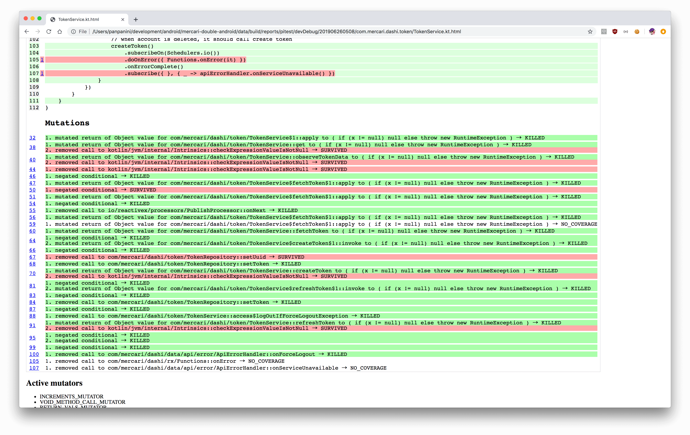

## Fixing broken robots - Android Mutation Testing
### DroidConSG 2019

---

<p><span class="slide-title">About me</span></p>


- Matthew Vern
- Twitter [@panini_ja](https://twitter.com/panini_ja)
- Github [panpanini](https://github.com/panpanini)
- Mercari, Inc
- Software Engineer (Android)

Note:
I'm a Software Engineer focusing on Android working at Mercari, a flea market application based in Japan and America.
---

<p><span class="slide-title">My job</span></p>

- Client Engineer
- Solving problems for our customers
- Shipping features
- Improve existing functionality

Note:
Like many of you here today, my job as a client engineer is about providing value to our customers, by solving problems. Our main tools for solving these problems are shipping features, and improving existing functionality. But the focus here is on shipping.

---

<p><span class="slide-title">My job</span></p>

- A non-shipped feature doesn't provide benefit
- Ship features as quick as possible

Note:
Before a feature is released, the customer doesn't get any benifit out of it, so its our job to make sure we can get these features out as quick as we can. To do this, we have many tools at our disposal:

Architecture patterns to reduce the cost of reading the code

OSS libraries to reduce the work required to implement common behaviour

Continuous Integration & release pipelines to reduce the work required to release the app

This is all well and good, but there is one small detail that we're forgetting
---

<p><span class="slide-title">My job</span></p>

- A shipped, broken feature doesn't provide benefit
- Ship _quality_ features as quick as possible

Note:
However, if we ship a feature that is buggy, or broken in some way, then this also doesn't provide benefit, and in extreme cases can actually reduce the benefit of the product. So really, we should be focused on shipping _quality_ features as quick as possible.

---

<p><span class="slide-title">Maintaining quality</span></p>

- QA |
- Code Review |
- Tests |

Note:
so, what are some of the ways that we can ensure quality of the features we are shipping?

One big way is with a Quality Assurance team. I mean the hint is in the name, but having someone else look at the feature you are working on is great for seeing how other people use the app, and is a good way to figure out bugs and unexpected user journeys, however the feedback loop is quite long, and so can be inefficient if employed improperly.

Next, we have Code Review. Similar to QA, having another person look at the code is good for spotting small mistakes, or other oversights we may have made when implementing the feature, because hey, we're only human right? And while the feedback loop is not quite as long as QA, it still can take some time, and depends on how busy the other engineers on your team are.

Finally, we come to tests. Tests can give us the quickest feedback in a way that we as engineers can understand easily

- this code _right here_ is not doing what we expected it to do

---

<p><span class="slide-title">Maintaining quality</span></p>

- How do we know our tests are providing quality
    - Use coverage to make sure that our tests are calling production code |
    - changes introduced will not break existing code |
    - new code _does what it says on the tin_ |


TODO: find a better word than providing
Note:
So how do we know that our tests are providing quality?

Well, we can use code coverage right? by using coverage, we can show how much of our code is being run by the tests, and so we then know how safe we are when changing the code.

Code coverage can give us insurance that any changes we introduce won't break existing code

Code coverage can also give us insurance that newly added features are working as intended

---

 ## Who w̶a̶t̶c̶h̶e̶s̶tests the w̶a̶t̶c̶h̶testmen?

 Note:
 In my research every talk on mutation testing had to have this slide, so I had to continue the tradition. who watches the watchmen?
 TODO: fix the text here

---

<p><span class="slide-title">Maintaining quality</span></p>

- How do we know that our tests are quality?


Note:
How do we know the quality of our tests?

---

## What are tests?

- asserting that our assumptions about a piece of code are correct |
- binary assertions of code correctness |


Note:
Unit test are a way of confirming that a certain piece of code is working the way we expect it to work.

- "this code should behave in a certain way, if it doesn't, then the test should fail"
- "if the code changes, the tests should fail"
- "tests should fail"
- if we change the code, the tests should fail

---

# Lets fail some tests

---

## Lets fail some tests

- Unit tests assert code behaviour
- change code behaviour
- tests fail
- ????
- profit

Note:
Unit tests should fail
why didn't anyone think of this earlier?

---

# Mutation testing

---

<p><span class="slide-title">Mutation testing</span></p>

- proposed by Richard Lipton in 1971
- computationally expensive, not a viable testing solution until recently
Note:
Like all good ideas, someone came up with it already. Mutation testing was originally proposed back in the 70's, however it has only recently become viable thanks to advancements in computer processing.
---

<p><span class="slide-title">Mutation testing steps</span></p>

1. Create a mutant
2. Run test suite
3. Confirm if mutant was detected or not
4. Repeat

Note:
The basic loop for a mutation test is as follows:
first, we introduce a fault or mutation into the production code.
next, we run our test suite and collect the results.
and then third, we confirm if the fault was detected or not.
We consider the fault "detected" if at least 1 test in the suite has failed.

---

## What is a mutant?

- A mutant is a biological entity which has undergone a change in its genetic structure.

Note:
If you have a look at Wikipedia, they describe a mutant as being a biological entity which has undergone a change in its genetic structure.

Basically, you have one thing over here. you change it slightly, and then you get another thing. that other thing is a mutant of the first.

In our case, we're talking about code, so we can rewrite the definition to be something like this

---

## What is a mutant?

- A mutant is a code block which has undergone a change in its structure.

Note:
We have a block of code, we change it slightly, which produces our mutant. 

---

TODO: Create sample piece of code, then find mutations from it?
``` kotlin


```
Note:
Alright, lets start mutating some code! Take this function as an example
TODO: explain code
---

## Creating mutations

 - Competent Programmer Hypothesis |
 - Coupling Effect |

Note:
Now we could go randomly changing code to create mutants, but remember that for each mutant we create, we have to run all the tests against it to make sure it is killed, so we want to be methodical about the changes that we make.

This is actually a fairly well researched area, so if you Google you can find lists of mutators for object-oriented languages, however the basic idea behind creating mutations follows these two theories.

The competent Programmer Hypothesis states that bugs introduced by competent programmers are more often than not small syntatical errors, which are often hard to notice during code review.

Secondly, the Coupling effect states that small issues will stack up to create big issues, so if we can reduce small issues then we can also reduce the big issues at the same time.

With that in mind, lets take a look at a couple of these as an example, arranged in order of perceived evilness, which is a metric I made up based on how difficult I think these types of faults are to find.

---
## Conditionals boundary

replaces relational operators (<, <=, >, >=) with their boundary counterpart

| Original | Mutated |
|-|-|
| < | <= |
| <= | < |
| > | >= |
| >= | > |

Note:
First lets start off with a fairly simple, but common one, the conditionals boundary operator. Mutation operators generally consist of two things - the original production code, and the code it should be mutated into.
---
## Conditionals boundary
``` kotlin
// original
if (a < b) {
  // do something
}

// mutated
if (a <= b) {
  // do something
}
```
Note:
So if we apply this to our previous code example, we come up with a mutant that looks like this. Now - thats pretty evil, this is definitely the kind of thing that could slip through code review, and this kind of edge case is unlikely to be covered by tests, unless you have gone out of your way to write a test specifically for this boundary.

Our next contender is slightly more evil, the math operator
---
## Math @emoji[smiling_imp]

replaces binary arithmetic operations

| Original | Mutated |
|-|-|
| + | - |
| - | + |
| * | / |
| / | * |

Note:
This lil critter will take your nicely crafted binary arithmetic and swap it all around. for example
---?code=src/main/kotlin/math.kt&lang=kotlin
## Math @emoji[smiling_imp]

Note:
did you notice the change?
@[3, 10](Our minus operator)
This one character change can easily lead to an `IndexOutOfBoundsException`

---
## Negate Conditionals @emoji[smiling_imp]@emoji[smiling_imp]

replaces conditional checks

| Original | Mutated |
|-|-|
|==|!=|
| != | == |
| <= | > |
| > | <= |

Note:
Next we have the negate conditionals operator - are you seeing a pattern here? Here we take conditional checks, and reverse them.
---
## Negate Conditionals @emoji[smiling_imp]@emoji[smiling_imp]

``` kotlin
// original
fun buildModels() {
    ProgressModelView_()
      .title(title)
      ...
      .addIf(model.state == State.IN_PROGRESS)
}

// mutated
fun buildModels() {
    ProgressModelView_()
      .title(title)
      ...
      .addIf(model.state != State.IN_PROGRESS)
}
```

Note:
This one is pretty evil too, as even just this change on its own can lead to wildly different behaviour of our app, in this case showing the Progress view whenever the state is _not_ in progress.

---
## Remove void calls @emoji[smiling_imp]@emoji[smiling_imp]@emoji[smiling_imp]@emoji[smiling_imp]@emoji[smiling_imp]

*removes* void method calls

Note:
The last mutator I want to show is the Remove void calls operator, this one straight up removes calls to void methods. just deletes them. gone.

---
## Remove void calls @emoji[smiling_imp]@emoji[smiling_imp]@emoji[smiling_imp]@emoji[smiling_imp]@emoji[smiling_imp]

``` kotlin
// original
fun onNext(items: List<Item>) {
    controller.items = items
    controller.requestModelBuild()
}

// mutated
fun onNext(items: List<Item>) {
    controller.items = items

}
```
Note:
Back to our code from before, and bam, we're no longer building the models in our EpoxyController, so now our RecyclerView never gets updated.
This might sound like not that big of a deal, I think more often than not we forget to test void calls in functions, as to do so you have to properly set up mocks and actively call them.
---

<p><span class="slide-title">Mutation testing the better way</span></p>

1. Introduce a fault into production code
| 2. Use code coverage to determine which tests to run
3. Run tests
4. Confirm if fault was detected or not
5. Repeat


Note:
So, for our short snippet of code, we already have 4 mutations that we need to run the test suite against. If our test suite takes 5 minutes per run which is a pretty conservative estimate, then with just these 4 mutations we already have to spend 20 minutes testing these mutations, which isn't really realistic.
<next slide>
instead, if we use code coverage to find out which tests are actually calling this section of code, we can restrict our test runs to only those specific tests, which greatly reduces the number of tests we have to run, and so also reduces the time spent testing mutations to a more reasonable level.

---

## That's a lot of work you expect us to do there bud

Note:
you might be thinking
"now hold up there, are you telling me that I now need to keep *another* test suite to test my test suite? what happens if the mutant code gets into my production code base? this all seems like a lot of work"
and to that, I say *no*.
---

# Pitest


Note:
Let me introduce PITest!
---
## Pitest
- [pitest.org](www.pitest.org)
- mutation testing system
- mutants stored in memory
- outputs pretty reports
- Gradle plugin @emoji[heart_eyes_cat]

Note:
PItest is a mutation testing system for the JVM, and it has some pretty sweet features. It will automatically generate mutations based on the operator set provided. Also, the mutations are generated by editing the bytecode of a class after it has been loaded by the ClassLoader, which means that
a) mutations are never saved to disk
b) we don't have to pay the cost of loading the class for each test, so we gain some performance.

But one of the coolest features is that someone has written a gradle plugin, so we can integrate it directly into our Android app
---

## Gradle plugin

- [szpak/gradle-pitest-plugin](https://github.com/szpak/gradle-pitest-plugin)
- `apply plugin: pitest`
- generates `pitest<Variant>` tasks

Note:
The gradle plugin for pitest is great, because its almost plug & play. After importing the plugin, and setting up the set of target classes, the plugin will generate pitest tasks for each build variant, which will do _everything_ for you. The only downside about it...

---


Note:
is that it doesn't work with Android projects on its own. :innocent:
However, there is a fork that does work, so lets take a look at that
---

## Android Gradle plugin

- [koral--/gradle-pitest-plugin](https://github.com/koral--/gradle-pitest-plugin/)
- forked from szpak/gradle-pitest-plugin
- works with Android projects
- has some Android specific helpers (eg: generating mockable Android jar)

Note:
so koral on github has forked and fixed the pitest gradle plugin to work with Android, and added some extra helpers that are useful for Android projects, such as support for Robolectric. Installation is the same as the other gradle plugin, just apply the plugin to your build.gradle file and then declare which classes to test
---?code=src/main/kotlin/build.gradle.kts&lang=kotlin@name=build.gradle.kts

## Android Gradle plugin

Note:
@[8](apply the plugin)
@[11-16](add the pitest block)
@[13](set the target classes)

---



Note:
Its as easy as that! Then, we get this pretty report showing us how many missed conditions we have in our tests :)
---

# Pitest tips & tricks

Note:
Finally I'd like to finish on a couple of tips and tricks for getting your pitest setup working nicely
---
Pitest kotlin

- [pitest/pitest-kotlin](https://github.com/pitest/pitest-kotlin)
- MutationInterceptor
- Removes mutants for Kotlin generated code

Note:
First, if you're using kotlin, then the pitest-kotlin plugin is great.
Don't care about testing if `Intrinsics.checkParameterIsNotNull();` is removed, so this plugin will remove these mutations before they are tested, cleaning up the reports, and speeding up the test runtime.

---

## Run PITest on Unit tests only


Note:
Integration tests have too many potential variables, + could potentially be connected to DBs etc which will do bad things if you remove certain calls without mocking.
---

## Takeaways

- Our job is to ship *quality* features, fast
- Mutation testing helps us ensure *quality*
- PITest helps us do that *fast*
